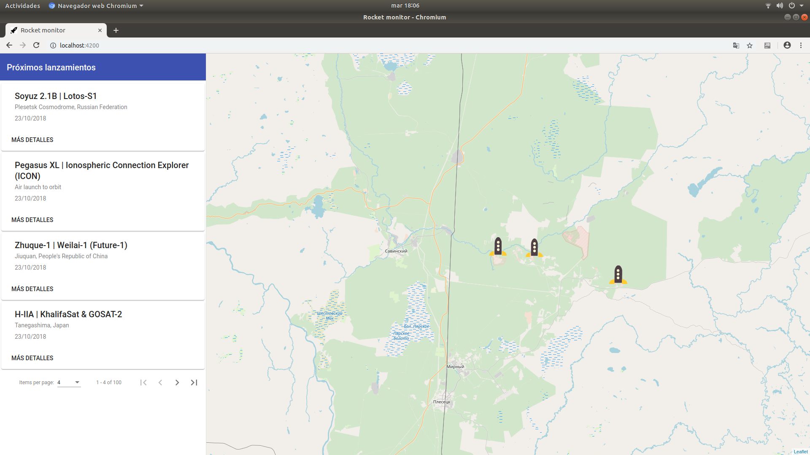
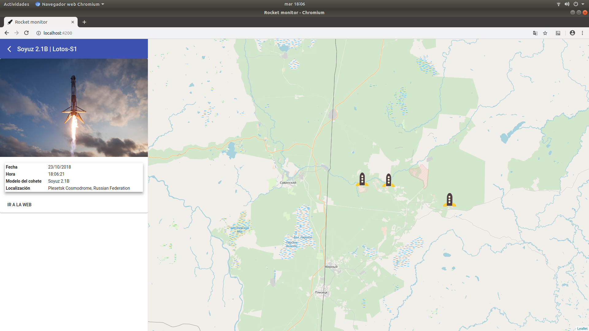

# Mapa interactivo de lanzamiento de cohetes espaciales
## Instrucciones de compilación y ejecución
Para la correcta ejecución se ha de lanzar el Back-End antes que el Front-End.
### Back End
#### Requisitos previos:
// TODO:

#### Instalación de dependencias
// TODO:

#### Puesta en marcha del servidor
```
$ cd back-end
$ python3 launcher.py
```

### Front End
#### Requisitos previos:
Se ha de tener instalado node 10.12 o superior y Angular CLI 6.2 o superior.

#### Instalación de dependencias
El primer paso a realizar la primera vez que se va a ejecutar el proyecto es instalar las dependencias de nodejs:
```
$ cd front-end
$ npm install
```

#### Puesta en marcha del servidor
Una vez están instaladas las dependencias, ya se puede lanzar el servidor:
```
$ cd front-end
$ ng serve
```

## Screenshots
Página principal |  Detalles de lanzamiento
:---------------:|:-----------------------:
 |   |
